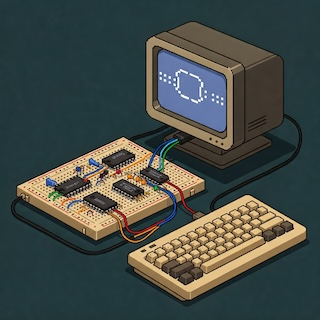

# Clementina 6502



[](https://goreportcard.com/report/github.com/fran150/clementina-6502)
[](https://golang.org/doc/devel/release.html)
[](https://opensource.org/licenses/MIT)
[](https://codecov.io/gh/fran150/clementina-6502)
[](https://pkg.go.dev/github.com/fran150/clementina-6502)

## Overview

Clementina 6502 is a cycle-accurate emulator for [Ben Eater's 6502 computer](https://eater.net/6502) with an interactive terminal-based user interface. This project provides a comprehensive emulation environment for learning about and experimenting with 6502-based computer systems.

The emulator reproduces the behavior of the 65C02S CPU and associated components, offering a platform for both educational purposes and retrocomputing enthusiasts.

## Why?

My journey with computers began in the 1980s when my dad brought home a Commodore 64. Those first BASIC programs I wrote sparked a passion for programming that's stuck with me ever since. I've always wanted to build my own computer from scratch, but my electronics skills weren't quite up to the task (I also wanted to create an OS, a programming language, a game...¯\_(ツ)_/¯).

Then one day I discovered Ben Eater's breadboard computer videos. I was completely hooked and couldn't stop watching. While I wanted to build Ben's 6502 computer, I also had ideas about extending it with my own modifications. That's when it clicked - why not create a software emulation instead?

There are already some great implementations out there, like the [Java 6502 Emulator](https://github.com/DylanSpeiser/Java-6502-Emulator), but I wanted to build my own from the ground up. I challenged myself to work primarily from reference documentation, only peeking at existing implementations when absolutely necessary. And why Go instead of a systems language like C or Rust? Simple - this project is my playground for fun and learning, and I just wanted to take Go for a ride!

## Key Features

### Hardware Emulation
- **Cycle-accurate 65C02S CPU** emulation with complete instruction set support
- **Full peripheral emulation**:
  - 65C22S VIA (Versatile Interface Adapter) with timers and I/O ports
  - 65C51N ACIA (Asynchronous Communications Interface Adapter) for serial communication
  - HD44780U LCD controller with character display support
  - 32K RAM and 32K ROM with proper memory mapping
- **Detailed bus system** with address and data buses, control lines, and interrupts

### Interactive Terminal UI
- **Multi-window interface** showing different aspects of the system:
  - CPU state (registers, flags, current instruction)
  - Memory contents (RAM/ROM)
  - LCD display output
  - VIA and ACIA state visualization
  - Bus status monitoring
- **Color-coded displays** for better readability and state visualization
- **Menu-driven operation** with keyboard shortcuts

### Debugging Capabilities
- **Breakpoint management** for targeted debugging
- **Single-step execution** for detailed analysis
- **Real-time state visualization** of all components
- **Configurable cycle duration** for running at specific speed

### I/O and Connectivity
- **Real serial port connectivity** for external device communication
- **Optional modem line emulation** (RTS, CTS, DTR, DSR)
- **Simple LCD display emulation** (no special characters yet!)

## System Requirements

- **Go 1.18 or later**
- **Terminal with ANSI color support**
- **Minimum terminal size**: 80x24 characters
- **For serial port functionality**:
  - Linux: appropriate permissions for serial port access
  - Windows: COM port drivers
  - macOS: no additional requirements

## Installation

### From Source

```bash
# Clone the repository
git clone https://github.com/fran150/clementina-6502.git
cd clementina-6502

# Build for your current platform
make build

# Or build for all platforms
make build-all

# Create release packages with assets
make release
```

### Pre-built Binaries

Download the latest release for your platform from the [GitHub Releases page](https://github.com/fran150/clementina-6502/releases).

#### Linux
```bash
# Extract the archive
unzip clementina-v0.3.0-linux-amd64.zip
cd clementina-v0.3.0-linux-amd64
# Run
./clementina
```

#### macOS
```bash
# Extract the archive
unzip clementina-v0.3.0-darwin-amd64.zip
cd clementina-darwin-amd64

# Run the setup script to remove security warnings
./setup-macos.sh

# Run the application
./clementina
```

#### Windows
```bash
# Extract the archive
# Using Explorer, right-click the ZIP file and select "Extract All"
# Navigate to the extracted folder
# Double-click clementina.exe or run from Command Prompt
```

### As a Go Package

To use Clementina 6502 as a Go package:

```bash
go get github.com/fran150/clementina-6502@latest
```

## Usage

### Basic Operation

```bash
# Run with default settings (uses included ROM)
./clementina

# Run with a specific ROM file
./clementina -r path/to/rom.bin

# Connect to a serial port
./clementina -p /dev/ttyUSB0

# Set skip cycles 1500 (execute one emulator cycle and skip 1500 CPU cycles) with 30 FPS display updates
./clementina -s 1500 -f 30

# Enable modem line emulation for serial ports
./clementina -p /dev/ttyUSB0 -e
```

### Command Line Options

| Flag | Description | Default |
|------|-------------|---------|
| `-r, --rom` | ROM file to load | `./assets/computer/beneater/eater.bin` |
| `-p, --port` | Serial port to connect to | None |
| `-s, --skip-cycles` | Number of CPU cycles to skip on every loop | 0 |
| `-f, --fps` | Target display refresh rate | 15 |
| `-e, --emulate-modem` | Enable modem lines emulation | false |

## Technical Details

The emulator includes the ROM image created by Ben that includes both wozmon and msbasic. See https://github.com/beneater/msbasic for details.

### Serial Communication

The emulator can connect to real serial ports using the port configuration set by Ben in the ROM:
- 19200 baud rate
- 8 data bits
- No parity
- 1 stop bit

For testing without physical hardware, you can use `socat` to create virtual serial ports:

```bash
socat -d -d pty,raw,echo=0 pty,raw,echo=0
```

## Debugging Tips

If you are testing the emulator with your own image, it includes some debugging tools to help you:

1. **Use breakpoints** to pause execution at specific addresses
1. **Single-step** through code to observe CPU and component behavior
1. **Monitor the bus window** to see data flow between components
1. **Adjust emulation speed** for better observation of fast operations
1. **Check the ACIA window** when debugging serial communication issues

## Troubleshooting

### Serial Port Access Denied
```bash
# Linux: Add user to dialout group
sudo usermod -a -G dialout $USER
# Log out and back in for changes to take effect
```

### Emulation Performance Issues
- Lower display refresh rate (`-f` flag)
- Verify ROM file integrity
- Enable debug logging for detailed diagnostics

### Display Rendering Issues
- Verify terminal supports ANSI escape codes
- Check terminal window size (minimum 80x24 required)
- Try different terminal emulators

## Performance Profiling

For profiling CPU performance:

```bash
go test -benchmem -run=^$ -bench ^BenchmarkProcessor$ github.com/fran150/clementina-6502/tests -cpuprofile clementina6502.prof
go tool pprof -http :8080 clementina6502.prof
```

## Known Issues and Limitations

1. Cycle Counter Accuracy: During emulator pause or step-by-step execution, the cycle counter displays inflated values. Normal operation resumes with accurate counting when the emulator is unpaused.
1. Execution Speed Control: The initial implementation featured automatic execution speed control (configurable in MHz). However, due to timer resolution limitations in Windows, the system now uses cycle skipping instead. Performance improvements are planned for future releases.
1. Modem Line Emulation: The modem line emulation features have not been tested.
1. Serial port functionality has been tested using `socat` only, pending verification with a real port and terminal emulator.

## Contributing

Contributions are welcome! Please feel free to submit a Pull Request.

## License

This project is licensed under the MIT License - see the LICENSE file for details.

## Acknowledgments

- [Ben Eater](https://eater.net/) for the [original 6502 computer design](https://eater.net/6502)
- The Go community for excellent libraries and tools
- Amazing 6502 reference http://www.6502.org/users/obelisk/65C02/reference.html
- Very detailed description of 6502 / 6510 processors: https://www.atarihq.com/danb/files/64doc.txt. I used it to read about the intermediate cycles for each instruction.
- More 6502 references: http://www.6502.org/tutorials/65c02opcodes.html
- Details about the VIA chip: https://lateblt.tripod.com/bit67.txt
- 6522 reference: https://web.archive.org/web/20160108173129if_/http://archive.6502.org/datasheets/mos_6522_preliminary_nov_1977.pdf
- Another 6522 reference: https://swh.princeton.edu/~mae412/TEXT/NTRAK2002/20.pdf
- LCD Simulator: http://www.dinceraydin.com/djlcdsim/djlcdsim.html I've used it to test the behaviour of certain instructions.
- Details about HD44780 addressing with different LCDs: https://web.alfredstate.edu/faculty/weimandn/lcd/lcd_addressing/lcd_addressing_index.html
- Amazing JAVA Emulator for Ben's computer: https://github.com/paulfisher53/Java-6502-Emulator