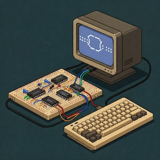

 
# Clementina 6502 - A Feature-Rich 6502 Computer Emulator with Terminal UI

Clementina 6502 is a comprehensive emulator for Ben Eater's 6502 computer that provides cycle-accurate emulation with an interactive terminal-based user interface. It features full emulation of the 65C02S CPU, VIA, ACIA, LCD controller, and memory components with real serial port connectivity.

The emulator offers precise control over execution speed, breakpoint debugging, component state visualization, and serial communication capabilities. Key features include:
- Cycle-accurate 65C02S CPU emulation with full instruction set support
- Real-time visualization of CPU registers, memory, buses, and component states
- Interactive debugging with breakpoints and single-stepping
- Configurable emulation speed from sub-Hz to MHz
- Serial port connectivity with optional modem line emulation
- LCD display emulation with character support
- VIA and ACIA peripheral emulation

## Usage Instructions
### Prerequisites
- Go 1.18 or later
- For serial port functionality:
  - Linux: appropriate permissions for serial port access
  - Windows: COM port drivers
  - macOS: no additional requirements

### Installation

```bash
# Clone the repository
git clone https://github.com/yourusername/clementina6502.git
cd clementina6502

# Build the project
go build -o clementina ./cmd/clementina.go
```

### Quick Start
1. Run the emulator with default settings:
```bash
./clementina
```

2. Run with a specific ROM file and serial port:
```bash
./clementina -r path/to/rom.bin -p /dev/ttyUSB0
```

### More Detailed Examples

1. Configure emulation speed and display refresh rate:
```bash
./clementina -m 1.2 -f 30  # Run at 1.2 MHz with 30 FPS display updates
```

2. Enable modem line emulation for serial ports:
```bash
./clementina -p /dev/ttyUSB0 -e
```

### Troubleshooting

Common issues and solutions:

1. Serial Port Access Denied
```bash
# Linux: Add user to dialout group
sudo usermod -a -G dialout $USER
# Log out and back in for changes to take effect
```

2. Emulation Performance Issues
- Check CPU usage and reduce target speed (-m flag)
- Lower display refresh rate (-f flag)
- Verify ROM file integrity
- Enable debug logging for detailed diagnostics

3. Display Rendering Issues
- Verify terminal supports ANSI escape codes
- Check terminal window size (minimum 80x24 required)
- Try different terminal emulators

### Port emulation

In order to test the emulator I use SOCAT to create pseudo interconnected ports.
Ben's computer operates with 8-N-1, 19200 bps

```
socat -d -d pty,raw,echo=0 pty,raw,echo=0
```

### Profiling

For profiling the CPU I'm using

```
go test -benchmem -run=^$ -bench ^BenchmarkProcessor$ github.com/fran150/clementina6502/tests -cpuprofile clementina6502.prof
```

and then:

```
go tool pprof -http :8080  clementina6502.prof
```